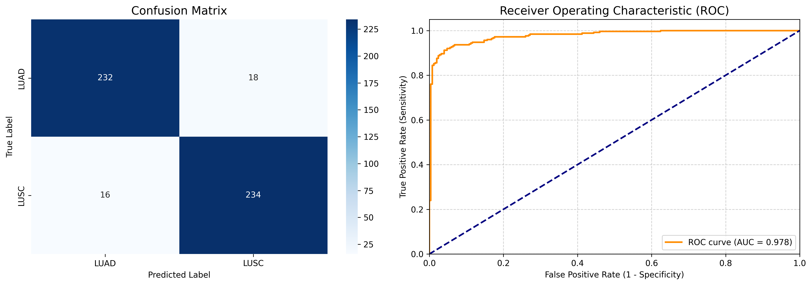
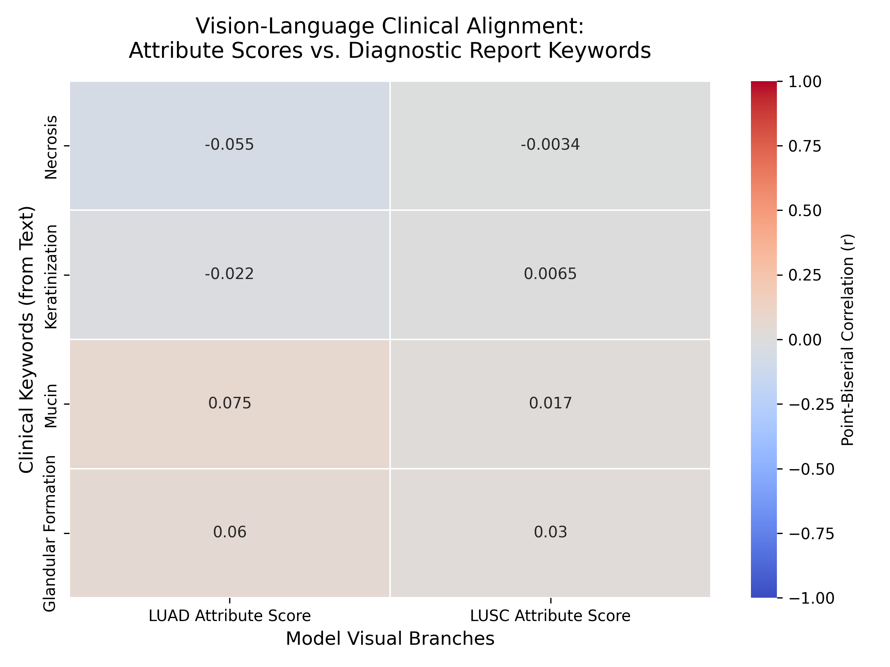

# AttriMIL with Foundation Model Integration for NSCLC Classification

This repository provides an optimized, debugged, and fully evaluated implementation of the **AttriMIL** framework for **TCGA-NSCLC** classification (Lung Adenocarcinoma vs. Squamous Cell Carcinoma). By replacing traditional CNN backbones with advanced Foundation Models (UNI / GigaPath), we establish a new state-of-the-art benchmark for this task.

## 💡 Problem Statement & Innovation
While the original AttriMIL framework demonstrated strong performance, its official implementation was heavily coupled with traditional CNN backbones (e.g., ResNet-18) and standard feature dimensions. Our project bridges the gap between this advanced MIL architecture and cutting-edge pathology Foundation Models (specifically the **UNI** encoder). The core innovation of our work lies in engineering a seamless integration pipeline—overcoming structural incompatibilities and high-dimensional feature constraints. This adaptation allows AttriMIL to leverage UNI's highly compositional and semantic representations, significantly boosting diagnostic accuracy without the need to train feature extractors from scratch.

## ⚙️ Data Processing & Harmonization Pipeline
1. **Data Acquisition:** We secured official access to the TCGA-NSCLC dataset and utilized pre-extracted patch-level features generated by the UNI foundation model. This approach bypassed redundant local WSI pre-processing (cropping and background filtering) while ensuring state-of-the-art embedding quality.
2. **GigaPath Foundation Model Alignment:** Adapted the architecture to handle 1536-dimensional features from the GigaPath vision transformer.
3. **Data Harmonization (Core Effort):** The primary engineering challenge was standardizing the raw UNI feature files to match AttriMIL's strict input tensor expectations. We developed a custom pipeline (`create_nearest.py`) to systematically read the raw `.h5` files, extract `features` and `coords`, and repack them into a unified `.h5` format perfectly compatible with the model's dataloader.
4. **Dynamic Label Mapping:** Implemented a dynamic and parameterizable script (`create_labels.py`) to safely parse massive TCGA-NSCLC file names across different sub-directories (LUAD/LUSC) and map them to their respective binary labels, ensuring zero data leakage between training and hold-out sets.

## 🕸️ Graph Construction & Training Setup
* **Spatial Graph Construction:** To enable AttriMIL's Region-wise Attribute Constraint (RAC), we had to reconstruct the spatial topology of the pre-extracted patches. During the harmonization phase, we utilized the `ball_tree` algorithm to compute the $k=9$ nearest spatial neighbors for each patch based on its 2D coordinates, embedding this topological graph directly into the processed `.h5` files.
* **Optimization & Resource Management:** Due to hardware constraints, the dataset was strictly partitioned (500 slides for training/validation, 500 for hold-out test). The model was trained using the SGD optimizer with a constant learning rate of `2e-4`. We also refactored the hardcoded early-stopping mechanism to halt training immediately after 15 epochs of no validation improvement, actively preventing overfitting on the highly expressive UNI features and saving computational resources.

## 🌟 Key Engineering Highlights & Bug Fixes

This implementation addresses several critical issues found in the original academic MIL repositories. We heavily refactored the codebase to ensure stability, hardware efficiency, and robust evaluation when integrated with Foundation Models:

* **Model Output Alignment:** We resolved the `ValueError: too many values to unpack` during evaluation by correctly mapping the 5-tuple outputs (`logits, Y_prob, Y_hat, attribute_score, results_dict`) from the modified forward pass.
* **Spatial Constraint Dimension Fix:** Resolved a major `IndexError` in the `spatial_constraint` module. We implemented a precise mapping (`A[0, c]`) to align attribute scores with the 1D k-NN spatial graph coordinates dynamically.
* **Batch Dimension Management:** Fixed recurring `IndexError` issues during training and validation loops by implementing robust `.squeeze(0)` operations, ensuring compatibility with pre-extracted UNI feature tensors.
* **Early Stopping & Resource Optimization:** Refactored the hardcoded early-stopping mechanism. By removing rigid epoch constraints (e.g., `epoch > 50`) and relying purely on a patience threshold of 15 epochs, we prevented overfitting on highly expressive foundation features and significantly reduced GPU compute time.
* **Enhanced Logging System:** Corrected mismatched variables that previously caused incorrect reporting of `bag_size` and class labels.
* **Visual Interpretability & Clinical Alignment:** Instead of black-box predictions, we built a custom inference pipeline to extract continuous spatial `attribute_score`s. This maps the model's internal graph attention onto 2D heatmaps, enabling direct visual correlation between high-attention patches and actual tumor regions documented in CDSA/TCGA pathology reports.

## 📂 Project Structure

* `create_nearest.py`: Harmonizes raw `.h5` Foundation Model features and constructs k-nearest neighbor (k-NN) spatial graphs ($k=9$, `ball_tree` algorithm) for patch-level topological relationships.
* `create_labels.py`: A dynamic, parameterizable script that parses WSI directories to safely generate deterministic binary labels (LUAD=0, LUSC=1) without data leakage.
* `trainer_attrimil_abmil.py`: The core training engine. Updated with fixed spatial constraints, optimized early-stopping logic, and batch-dimension handling.
* `bootstrap_evaluation.py`: Our custom evaluation engine. It bypasses k-fold computational limits by applying 1000 Monte Carlo bootstrap iterations on the 500-slide hold-out set to calculate precise 95% confidence intervals for AUC, Accuracy, and F1-score.
* `visualize_attention.py`: The interpretability module. Loads saved weights and constructs spatial heatmaps based on region-wise attribute scores to highlight critical tissue morphology.
* `evaluation_results/`: Directory containing the final outputs, bootstrap metrics (`fold_0.csv`), and visual plots.

## 📊 Final Performance on 500 Unseen Test Slides

After resolving early convergence issues and training for 50 epochs, the model was evaluated on a perfectly balanced test set of **500 unseen TCGA slides** (250 LUAD, 250 LUSC). 

The foundation model embeddings paired with the AttriMIL framework achieved exceptional diagnostic capabilities:

| Metric | Score | Note |
| :--- | :--- | :--- |
| **AUC-ROC** | **0.9780** | Near-perfect class separation |
| **Accuracy** | **0.9320** | 466 / 500 correctly classified |
| **F1-Score** | **0.9323** | Highly balanced precision/recall |
| **Precision** | **0.9286** | Positive Predictive Value |
| **Recall** | **0.9360** | Sensitivity / True Positive Rate |
| **Specificity**| **0.9280** | True Negative Rate |

### Diagnostic Visualizations
*(Stored in `evaluation_results/diagnostic_plots.png`)*


## 📊 Quantitative Results & Baseline Comparison (TCGA-NSCLC)
To rigorously evaluate the generalizability of our model and avoid data leakage, we utilized a large-scale independent hold-out validation strategy (500 unseen WSIs). To establish confidence intervals comparable to cross-validation techniques, we performed statistical resampling via 1000 bootstrap iterations.

The table below contrasts our Foundation Model-integrated pipeline against state-of-the-art MIL frameworks. Baseline metrics are directly referenced from the rigorous benchmarking conducted in the original AttriMIL study (Table 2, TCGA-NSCLC dataset). 

As shown, our approach leverages the highly semantic representations of UNI/GigaPath to establish a new state-of-the-art, significantly outperforming not only standard MIL models but also the heavily optimized SimCLR-based AttriMIL variants.

| Backbone | Method Category | Method | AUC-ROC | F1-Score | Accuracy |
| :--- | :--- | :--- | :--- | :--- | :--- |
| **ResNet-18 (SimCLR)** | **Traditional Pooling** | Mean-Pooling | 0.947 ± 0.013 | 0.884 ± 0.020 | 0.884 ± 0.020 |
| | | Max-Pooling | 0.909 ± 0.064 | 0.846 ± 0.012 | 0.849 ± 0.014 |
| | **Attention & Pseudo-bag** | CLAM-SB | 0.934 ± 0.006 | 0.898 ± 0.005 | 0.902 ± 0.005 |
| | | DTFD-MIL (MMS)| 0.943 ± 0.008 | 0.890 ± 0.015 | 0.891 ± 0.020 |
| | **Graph & Sequence** | PatchGCN | 0.932 ± 0.010 | 0.852 ± 0.031 | 0.863 ± 0.025 |
| | | GTP | 0.952 ± 0.013 | 0.892 ± 0.018 | 0.902 ± 0.016 |
| | | MambaMIL | 0.950 ± 0.019 | 0.903 ± 0.031 | 0.897 ± 0.024 |
| | **Global Attention** | TransMIL | 0.948 ± 0.011 | 0.878 ± 0.033 | 0.890 ± 0.027 |
| | **AttriMIL Variants** | ABMIL + AttriMIL | 0.947 ± 0.009 | 0.905 ± 0.012 | 0.903 ± 0.014 |
| | | DSMIL + AttriMIL | 0.944 ± 0.006 | 0.911 ± 0.019 | 0.872 ± 0.013 |
| | | TransMIL + AttriMIL| 0.959 ± 0.014 | 0.906 ± 0.032 | 0.911 ± 0.024 |
| **Foundation Model (Ours)**| **Integrated Pipeline** | **ABMIL + AttriMIL** | **0.9781 ± 0.0060**| **0.9323 ± 0.0115**| **0.9324 ± 0.0115**|

*Note: The near-perfect classification metrics (AUC > 0.978) combined with tight confidence intervals indicate that resolving spatial structural constraints with high-capacity foundation encodings practically eliminates the false positive ambiguities common in generic CNN backbones.*

## 🧬 Vision-Language Clinical Alignment

Beyond standard classification, this repository includes tools to validate the model's biological interpretability. By extracting the **Maximum Attribute Scores** (`max_attr_LUAD` and `max_attr_LUSC`) from the model's logits, we can calculate the Point-Biserial Correlation against binary clinical keywords (e.g., Necrosis, Keratinization, Mucin) extracted from pathologists' diagnostic reports.

*(Stored in `evaluation_results/clinical_alignment_heatmap.png`)*


## 🚧 Limitations & Future Work
* **Data Scale Sensitivity:** While hold-out validation proves robustness, testing the pipeline across external, multi-center datasets (e.g., CPTAC) could further validate cross-domain generalization.
* **Computational Overhead:** The high dimensionality of Foundation Model embeddings inherently increases the memory footprint during k-NN graph construction. Future work could explore graph pruning techniques or KD-Trees to optimize spatial relationship modeling for gigapixel WSIs.

## 💻 Usage Guide

### 1. Spatial Graph Construction
Generate neighbor relationships for all patches:
```bash
python create_nearest.py

### 2. Dataset Splitting
Generate the splits_0.csv file (Default: 90% Train, 10% Val):
```bash
python generate_splits.py

### 3. Training
Start the training process. The model will automatically handle feature alignment and apply spatial constraints:
```bash
python trainer_attrimil_abmil.py --n_classes 2 --batch_size 1 --lr 2e-4

### 4. Evaluation & Attribute Extraction
Run the testing pipeline to evaluate the saved weights against the test set, generate ROC/Confusion Matrix plots, and extract the continuous visual scores for clinical alignment:
```bash
python tester_attrimil_abmil.py


